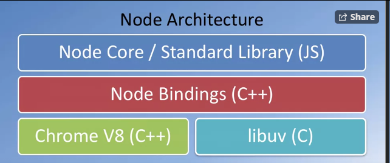

Full Stack implemented on 3 tier architecture development
* Presentation layer
* Business Logic Layer: Data validations
* Data access Layer : crud operations via API

Git commands practised:
* git config --global user.email
* git config --global user.name
* git config --list
* git init
* git status
* git add .
* git commit -m ""
* git checkout -- <commit> <file> : revert the file changes as present in given commit, but when you use this command your file will be moved back from the commit area to the staging area. If you want to proceed with the content, then you can make another commit, else you can your checkout action via git reset command as following

* git reset HEAD <file>:
	* git reset <file> = Unstages a staged file,but leave working directory alone
	* git reset = reset the staging area to last commit without disturbing the working direcory
	* moves file from the staging area to un-staged/ working area, but the content will be the same as above. From here you can use the same command git checkout -- <file> to revert the previous file changes.

Remote Commands
* git remote add <name> <url>
* git push -u <name> <branch>
* git clone <url>

Node Architecture:

What is package.json?
* documentation of current projects
* dependencies along with their versions
* deployments/builds easy for other developers
* Symbol used in package.json: '^' is used for use a paticular or the above mentioned verion.

Why Javascript Frameworks?
* When we want to have a large number of dom manipulations the jquery fails sometimes. This is where the frameworks come in picture.
* These frameworks use well defined architecture like MVC, MVVM, MVW
* Not only architecture but also control the functioning of the architecture via controller

<table>
	<tr align="center" font-style="bold italic">
		<th>Software Framework</th>
		<th>Software Library</th>
	</tr>
	<tr>
		<th colspan="2">Definition</th>
	</tr>
	<tr>
		<td>
			<ul>
				<li>Abstraction of the software which provides generic funcionality, where others can add/implement their own changes.</li>
				<li>Thus framework changes according to the end user written code</li>
			</ul>
		</td>
		<td>A collection of implementation with well defined interface, where the implementions are invoked to reuse/redo a work</td>
	</tr>
	<tr>
		<th colspan="2">Advantages</th>
	</tr>
	<tr>
		<td>
			<ul>
				<li>Universal & Reusable Environment</li>
			</ul>
		</td>
		<td>
			<ul>
				<li>Reusability</li>
				<li>Modularity</li>
			</ul>
		</td>
	</tr>
	<tr>
		<th colspan="2">Example</th>
	</tr>
	<tr>
		<td>
			<ul>
				<li>Angular</li>
				<li>Ember</li>
				<li>Backbone</li>
			</ul>
		</td>
		<td>
			<ul>
				<li>JQuery</li>
				<li>React</li>
			</ul>
		</td>
	</tr>
	<tr>
		<th colspan="2">Distinguish Parameters</th>
	</tr>
	<tr>
		<td>
			<ul>
				<li>A paticular implementation of application, where your code is fills the details.</li>
				<li>The framework is in charge of execution and calls to your code  when it needs specific</li>
				<li>Thus the above point can be said as we are surrendered to the framework. This is called as **_ Inversion of Control _**
				<li>This is a Declarative Programming, where we define a program
					<ul>
						<li>what to do</li>
						<li>how to do.</li>
						<li>The execution part(when to do) is taken care by the software/framework by leaving the trails/events when to execute</li>	
					</ul>
				</li>
			</ul>
		</td>
		<td>
			<ul>
				<li>A collection of functions which are useful when writing applications.</li>
				<li>Your code is in charge to call a method from a library, when it sees.</li>
				<li>The control of execution lies with in the programmer</li>
				<li>This is the Imperative Programming, where we define a program
					<ul>
						<li>what to do</li>
						<li>how to do</li>
						<li>when to do</li>
					</ul>
				</li>
			</ul>
		</td>
	</tr>
</table>

Popular Javascript Frameworks
* Angular
* Meteor
* Backbone
* Ember
* Polymer
* Knockout
* Vue
* Mercury
* React