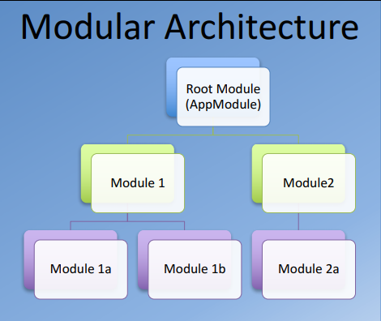
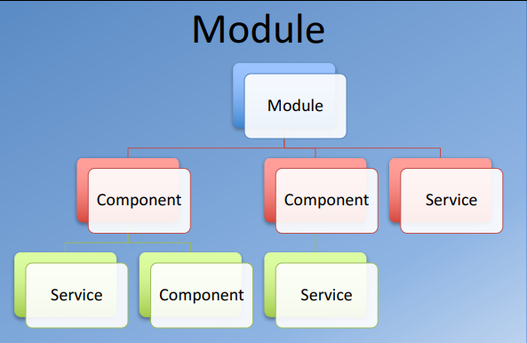
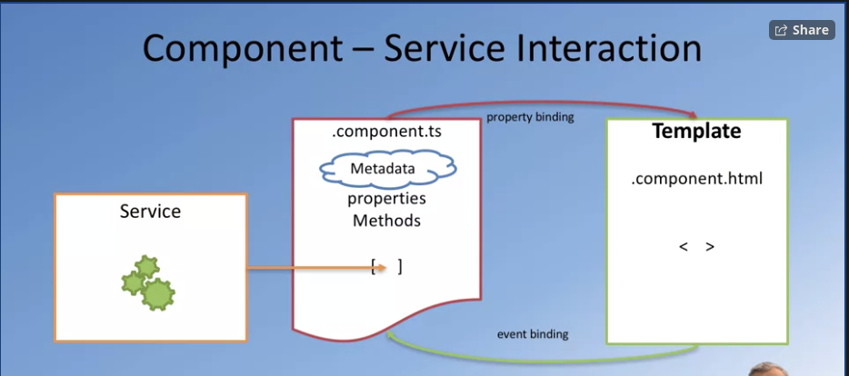

# Welcome to Angular

1. Evolved from AngularJS.(Version 1)
2. Then in version 2: where
	* complete rewrite of framework
	* **_Structural framework of developing the web applications_**
	* ng will be prefix for all the subcommands
	* designed as component based
	* support of mobile support
	* support of server-side rendering
	* support of powerful templates

Angular Vocabulary
* Data binding(1 way and 2 way)
* Components
* Services
* Providers
* Templates
* Routing
* Modules
* Testing
* CLI( skipping this content)

**Architecture** : 
This is modular in nature, that is angular first loads a default or root module(called as App) which inturns loads its child or child modules and so forth. Thus, a modules consists of component and services and providers all working together.

**Angular Modules**:
These are the key and starting points of the application.
 
Which inturn depend on
 
Note:

In this project we are going to make use of
1. Angular Material (cdk also as pre-requirement)
2. Hammer JS : for support of gestures in angular
3. Angular Animations

---

## Directives:

* The directives gives the instructions to angular on how to render a part of information/template to DOM.
* They can be defined with the help of a decorator in a class/ts file
	Example : components are defined with @Component directive in a typescript file

	### Structural Directives:
	* They helps us to add,remove and replace the elements in the DOM
	* Basically applied to HTML elements and its descendents elements
	* Common structural directives :
		1. NgIf
		2. NgFor
		3. NgSwitch

	### Attribute Directives:

---

## Databinding 

Mechanism of coordinating between
1. template -> involves rendering data and DOM Manipulation
2. component -> involves properties and thier changes.

Consider a data-bind example
* <app-name [mydata]="somedata"></app-name>
in which mydata is called as **_binding target_** and somedata is called as **_binding source_**, that is angular fetches content from the somedata and places it in mydata named object while rendering the component app-name.
* When angular renders app-name, we need to mention what are the properties that its going to get(or) what our component Datao output/return back data to parent component. This is done by marking or declaring them special decorators
	* @Input() decorator used for sending information from one component to other
	* @Output() decorator used for data from current component to parent component. Most of the time these are used as event emitters.

---

## Routing:

* Enable to navigate among views and components
* It uses browser url and **HTML 5 HISTORY API** to navigate
* This helps to load or change the url without reloading the page but rather load the specific parts of page based on the browser url. This is called as **_Single Page Applications_**
* **_[HTML 5 HISTORY API](https://developer.mozilla.org/en-US/docs/Web/API/History_API#Adding_and_modifying_history_entries)_** :
	1. pushState() - Add history entry
	2. replaceState() - modify history entry
	3. configure <base href="/">
* Key Terms in Angular Routing
	* Router Module - Angular built in library to support routing,
	* Routes - specifying a array of json object, ex: {path:"<some-pattern>",component:Component-to-be-loaded }
	* <router-outlet> - this directive used to tell angular application where to place above Routes in our application (mostly in app.component.ts)
	* routerLink - A link to tell angular to load a component based on the path/pattern present in routerLink href property, Ex : <a routerLink="/home">Home</a>
* Route Parameters : sending data from one component to another component via route.
	1. specifying the router link in view/html : 
	2. Specifying link/ executing link in method : this.router.navigate(['/dishDetail', d.id]);
	3. Retriving the data from the router link, This is where the angular's **_Activated Route Service_** is used

	### Activated Route Service

	* This is used to get the paramters present in a url
	* This Router service that provides information about
	1. url - 
	2. params - 
	3. queryParams - 

---

## Design Patterns - MVC, MVVM, MVW (Software design patterns)

* best book for design pattern -  Gang of four:E Gamma Design Patterns: Elements of Reusable Object-Oriented Software, Addison-Wesley,1994
* #### In MVC Desgin Pattern,
	* This pattern isolates the logic from user interface
	* Allows to independent development, testing and maintainance

## UI Design and Prototyping: Additional Resources

Wireframing, Mockups and UI Design
    * [Wireframe.cc](https://wireframe.cc/)
    * [Moqups.com](https://moqups.com/)
    * [Axure](http://www.axure.com/)
    * [proto.io](https://proto.io/)
    * [framerjs.com](http://framerjs.com/)
    * [The 20 best wireframe tools](http://www.creativebloq.com/wireframes/top-wireframing-tools-11121302)
    * [Web Design Inspirations](http://www.webdesign-inspiration.com/)
    * [Adobe Experience Design](http://www.adobe.com/products/experience-design.html)
    * [Free Bootstrap Wireframing Set for PowerPoint](https://onextrapixel.com/free-bootstrap-wireframing-set-for-powerpoint/)

UI Templates
    * [Bootstrap Expo](http://expo.getbootstrap.com/)
    * [Ionic Showcase](http://showcase.ionicframework.com/)

Information Architecture
    * [A visual vocabulary for describing information architecture and interaction design](http://www.jjg.net/ia/visvocab/)
    * [The Elements of User Experience](http://www.jjg.net/elements/)
    * [The Elements of User Experience: User-Centered Design for the Web and Beyond (2nd Edition) (Voices That Matter)](http://www.amazon.com/The-Elements-User-Experience-User-Centered/dp/0321683684/ref=pd_cp_14_1?ie=UTF8&refRID=0RXJWKFHY0TNF5QM2764)

---

## Services

mainly used for 
1. fetching data from server
2. user input validations
3. logging
4. provide/act a intermediate between view and application logic

Consider the following diagram  
 
* You can see that the event binding action is now taken care by service method which is called dynamically by angular.
* Based on the content changes made by the service, our propertie's value changed in our component.
* This in turns changes values present in view via property binding.
* If any new changes is occured, then with the help of event binding we receive new value with event properties and again send it to service
* Service again performs necessary applications logic on new data and changes the property value of component accordingly, 
* which leads to change in the values present in view
* In this way, the cycle continues.

While dealing with services, there are some basics to be learnt first. They are
1. <u>**_Dependency Injection_**</u> - 
	* this is a software desing pattern
	* this is used in situations where a object is dependent on another
	* **Dependency** - A object that can be used at any time (offering a service or work)
	* **Injection** - passing dependency to a dependent object, with out intervention of client or user
	* Thus if a object is dependent on other, it has 3 ways to create those objects
		1. Create dependencies using " new " operator
		2. Look up dependency using global variable
		3. Have dependency passed to it dynamically when needed. In this step there is no need to hardcode the logic or service code we are only focusing on injecting it. This makes modular development too.
	* Dependency Injection has 4 things/properties in it
		1. **Service** - the dynamic logic that we are going to make use of 
		2. **Client** - the code which makes use of service (in our case, component)
		3. **Interface** - Once service is injected, how to use it
		4. **Injector** - Entity that injects the service into client
	* **Angular and Dependency Injection** - 
		1. Angular uses DI to separate business logic and dependency construction.
		2. Angular's **_Injector_** subsystem is responsible for
			1. creating components
			2. resolving their dependencies
			3. providing them to other components
		3. creating a service in angular : ng generate service service_name.
		4. the above command creates a folder with name " service_name " with files **" service_name.service.ts "** and **" service_name.service.spec.ts "**
		5. In " service.service.ts" makes uses of **_Injectable Decorator : @Injectable_**. This decorator helps to inject the service into our components
		6. Thus to use the service in the angular, we need to register it in the **app.module.ts** file in **providers** array

2. <u>**_Promises_**</u> - 

3. <u>**_Reactive Javascript_**</u> - 

---

## Single Page Applications:

* web application where the website do reload only part it (where in older days there used to complete reload web page) for every interaction the user makes on page
* This is majorly used to decrease the round trip time of application and amount of request made from client to server and vice-versa
* In single page application, now server only used for the accessing or updating data to database to clients, remaining part of application like (validations, cookies, session management, route management etc) are done at client side
* **Chanllenges**
	* not used for the search engine applications
	* How to maintain history
	* Analytics - setup and collect
	* Speed up initial load

---

## Angular forms

* Here we make use of 2 way data binding for continous track of form change and error handling
* supports 2 types of forms
  1. Template Driven: 
     1. Use angular template syntax to construct angular elements
     2. Form Validation
     3. Make ngModel directive for 2 way data binding
     4. In order to make use of these forms, we need to
        1. import MatFormFieldModule
  2. Reactive Forms: 